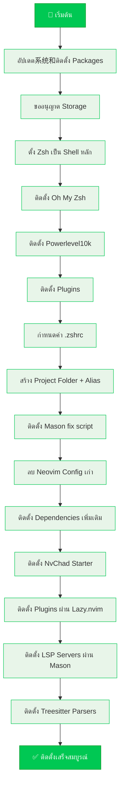
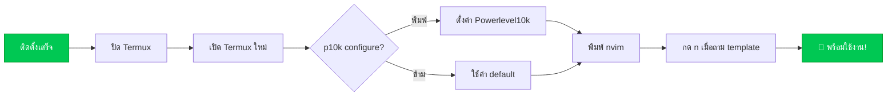
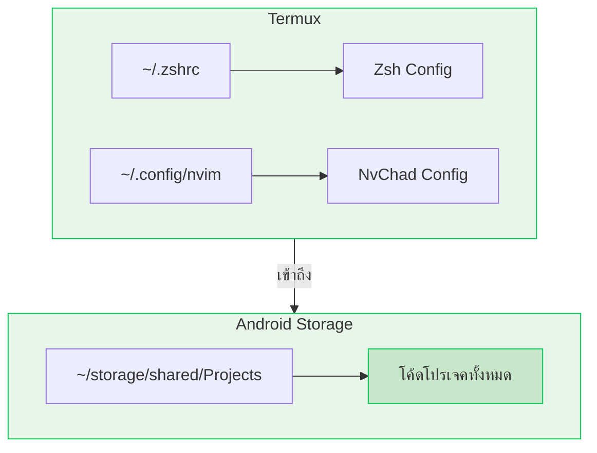

# 🌿 Termux Full Setup Script

> สคริปต์ติดตั้ง Termux แบบ All-in-One | ZSH + Powerlevel10k + NvChad + Mason


---

## 🧩 สิ่งที่จะได้หลังติดตั้ง

| ส่วนประกอบ | รายละเอียด |
|------------|-------------|
| 🐚 **Zsh** | Shell หลัก ใช้งานสะดวกกว่า Bash |
| 🎨 **Powerlevel10k** | ธีม Zsh สวยงาม ปรับแต่งได้ |
| 🔌 **zsh-autosuggestions** | แนะนำคำสั่งขณะพิมพ์ |
| ✨ **zsh-syntax-highlighting** | เน้นสีคำสั่ง |
| 📝 **Neovim + NvChad** | Editor ที่ทันสมัย พร้อม UI สวย |
| 🔧 **Mason** | จัดการ LSP servers ใน Neovim |
| 📂 **Alias** | คำสั่งลัดเข้าถึง Storage |

---

## 🔄 ขั้นตอนการติดตั้ง (Flowchart)



---

## 📥 วิธีติดตั้ง (Copy ไปรันใน Termux เลย)

```bash
cat > setup.sh << 'EOF'
#!/data/data/com.termux/files/usr/bin/bash

# ============================================
# Termux Full Setup Script
# ZSH + Powerlevel10k + Auto-suggestions + NvChad (Mason only)
# ============================================

echo "🚀 เริ่มต้นติดตั้ง Termux Environment..."

# 1. อัปเดตระบบและติดตั้ง packages พื้นฐาน
echo "📦 อัปเดตระบบและติดตั้ง packages..."
pkg update -y && pkg upgrade -y
pkg install -y git zsh neovim which termux-api termux-services

# 2. ตั้งค่า storage permission
echo "📂 ขออนุญาตเข้าถึง Storage..."
termux-setup-storage
sleep 2

# 3. ตั้ง Zsh เป็น shell หลัก
echo "🐚 ตั้งค่า Zsh เป็น Default Shell..."
chsh -s zsh

# 4. ดาวน์โหลดและติดตั้ง Oh My Zsh
echo "📥 ติดตั้ง Oh My Zsh..."
sh -c "$(curl -fsSL https://raw.github.com/ohmyzsh/ohmyzsh/master/tools/install.sh)" "" --unattended

# 5. ติดตั้ง Powerlevel10k theme
echo "🎨 ติดตั้ง Powerlevel10k theme..."
git clone --depth=1 https://github.com/romkatv/powerlevel10k.git ${ZSH_CUSTOM:-$HOME/.oh-my-zsh/custom}/themes/powerlevel10k

# 6. ติดตั้ง Zsh plugins (auto-suggestions + syntax-highlighting)
echo "🔌 ติดตั้ง Zsh plugins..."
git clone https://github.com/zsh-users/zsh-autosuggestions ${ZSH_CUSTOM:-~/.oh-my-zsh/custom}/plugins/zsh-autosuggestions
git clone https://github.com/zsh-users/zsh-syntax-highlighting.git ${ZSH_CUSTOM:-~/.oh-my-zsh/custom}/plugins/zsh-syntax-highlighting

# 7. แก้ไข .zshrc ให้ใช้ theme และ plugins
echo "⚙️ กำหนดค่า .zshrc..."
sed -i 's/ZSH_THEME="robbyrussell"/ZSH_THEME="powerlevel10k\/powerlevel10k"/' ~/.zshrc
sed -i 's/plugins=(git)/plugins=(git zsh-autosuggestions zsh-syntax-highlighting)/' ~/.zshrc

# 8. เพิ่ม alias ให้ git clone ไปที่ shared folder
echo "📁 สร้าง Project folder และเพิ่ม alias..."
mkdir -p ~/storage/shared/Projects
echo 'alias my="cd ~/storage/shared/Projects"' >> ~/.zshrc
echo 'alias gclonemyp="cd ~/storage/shared/Projects && git clone"' >> ~/.zshrc

# 9. ติดตั้ง Mason fix script สำหรับ Termux
echo "🔧 ติดตั้ง Mason fix script..."
pkg install which -y
curl -o /data/data/com.termux/files/usr/bin/install-in-mason https://raw.githubusercontent.com/Amirulmuuminin/setup-mason-for-termux/main/install-in-mason
chmod +x /data/data/com.termux/files/usr/bin/install-in-mason

echo ""
echo "=========================================="

# ลบ config เก่า
rm -rf ~/.config/nvim
rm -rf ~/.local/state/nvim
rm -rf ~/.local/share/nvim

# ติดตั้ง dependencies เพิ่มเติม
echo "📦 ติดตั้ง dependencies เพิ่มเติม..."
pkg install -y nodejs python ripgrep fd npm ollama curl lsd

# ติดตั้ง npm packages
npm install -g @aa-ok99/ants
npm i -g @devcorex/dev.x

# โคลน NvChad starter
echo "📝 ติดตั้ง NvChad..."
git clone https://github.com/NvChad/starter ~/.config/nvim

# ติดตั้ง plugins ผ่าน Lazy.nvim
echo "📦 กำลังติดตั้ง plugins..."
nvim --headless "+Lazy! sync" +qa

# ติดตั้ง LSP servers ผ่าน Mason
echo "🔧 กำลังติดตั้ง LSP servers..."
nvim --headless "+MasonInstallAll" +qa

# ติดตั้ง Treesitter parsers
echo "🌲 กำลังติดตั้ง Treesitter parsers..."
nvim --headless "+TSInstall lua python bash javascript typescript" +qa

# สร้าง alias สำหรับ bash
echo "alias vim='nvim'" >> ~/.bashrc
echo "alias nvim='nvim'" >> ~/.bashrc

echo "✅ ติดตั้งเสร็จสมบูรณ์!"
echo "=========================================="
echo ""
echo "📌 ขั้นตอนต่อไป:"
echo "1. รีสตาร์ท Termux (ปิดแล้วเปิดใหม่)"
echo "2. ตั้งค่า Powerlevel10k: พิมพ์ 'p10k configure'"
echo "3. เปิด Neovim ครั้งแรก: พิมพ์ 'nvim' (กด n เมื่อถาม chadrc template)"
echo "4. ใช้ Mason ติดตั้ง LSP: install-in-mason <ชื่อlsp>"
echo ""
echo "📂 Project folder อยู่ที่: ~/storage/shared/Projects"
echo "🐚 คำสั่งลัด: 'my' = ไปที่ Project folder"
echo "🐚 'gclonemyp' = git clone ใน Project folder"
echo "=========================================="
EOF

chmod +x setup.sh
./setup.sh
```

---

## 📌 หลังติดตั้งเสร็จ (Post-Install)



---

## 🛠️ คำสั่งที่ใช้บ่อยหลังติดตั้ง

| คำสั่ง | หน้าที่ |
|--------|--------|
| `nvim` | เปิด Neovim |
| `p10k configure` | ปรับแต่งธีม Powerlevel10k |
| `install-in-mason <lsp>` | ติดตั้ง LSP server (เช่น `install-in-mason pyright`) |
| `my` | ไปที่ `~/storage/shared/Projects` |
| `gclonemyp <url>` | git clone ไปไว้ใน Projects |
| `:Mason` | ดู LSP ที่ติดตั้งใน Neovim |

---

## 🌿 ตัวอย่างการติดตั้ง LSP เพิ่มเติม

```bash
install-in-mason lua-language-server   # สำหรับ Lua
install-in-mason pyright                # สำหรับ Python
install-in-mason typescript-language-server  # สำหรับ TS/JS
install-in-mason rust-analyzer          # สำหรับ Rust
```

---

## 📂 โครงสร้างโฟลเดอร์สำคัญ



---

## ❗ ปัญหาที่พบบ่อย (Troubleshooting)

| ปัญหา | วิธีแก้ไข |
|--------|----------|
| Neovim ค้างตอนเปิดครั้งแรก | รอสักครู่ หรือกด `Ctrl+C` แล้วเปิดใหม่ |
| Mason ไม่ติดตั้ง LSP | ใช้ `install-in-mason` แทน `:MasonInstall` |
| Zsh ไม่เป็น default | ปิด Termux แล้วเปิดใหม่ หรือพิมพ์ `zsh` |
| Permission denied | ตรวจสอบว่า `chmod +x setup.sh` แล้ว |
| Storage ไม่เข้า | รัน `termux-setup-storage` แล้วอนุญาต |

---

## 🧹 ถ้าต้องการติดตั้งใหม่ทั้งหมด

```bash
rm -rf ~/.config/nvim ~/.local/state/nvim ~/.local/share/nvim
rm -rf ~/.oh-my-zsh
./setup.sh
```

---

## 🙏 เครดิต

- [Oh My Zsh](https://ohmyz.sh/)
- [Powerlevel10k](https://github.com/romkatv/powerlevel10k)
- [NvChad](https://nvchad.com/)
- [Mason for Termux](https://github.com/Amirulmuuminin/setup-mason-for-termux)

---

<div align="center">

**🌿 ติดตั้งเสร็จแล้ว เทอร์มินัลคุณจะดูดีขึ้น 100% 🌿**

[]()

</div>
